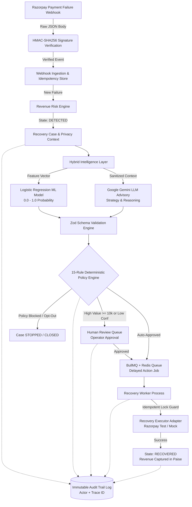
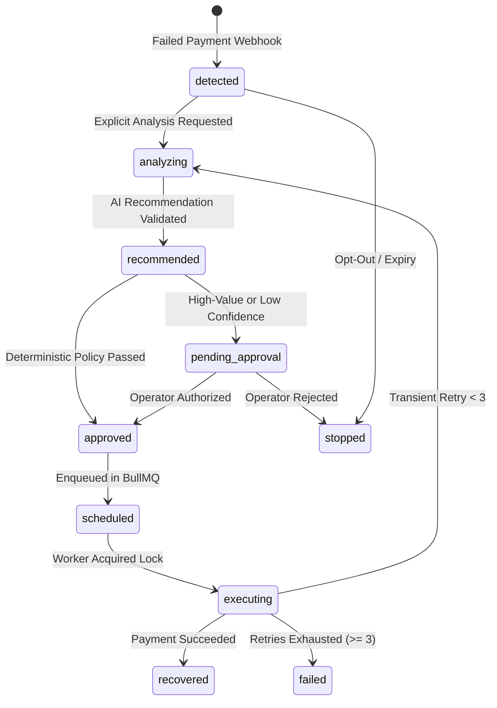

# System Architecture & Technical Design

## 1. High-Level System Architecture

---

## 2. Fundamental FinTech Boundary
> **"AI Recommends. Backend Policy Decides."**

In financial transactions, Large Language Models are non-deterministic and prone to hallucination. RazorRecover enforces a strict architectural boundary:
* **The AI Layer is purely advisory:** Generates structured strategy JSON validated strictly via Zod (`RecoveryRecommendationSchema`).
* **The Backend Policy Engine is the sole authority:** Evaluates deterministic financial rules (amount limits $\ge ₹10,000$, customer opt-outs, retry limits, active locks) before any action can ever be queued or executed.
* **The Worker executes safely:** Ensures idempotent execution via unique keys and prevents duplicate double-charges.

---

## 3. Asynchronous Job Processing (BullMQ & Redis)
* Delayed recovery actions (e.g. `RETRY_LATER` after 6 hours) are persisted in Redis.
* Independent worker processes (`npm run worker`) run outside the API server to protect HTTP latency.
* **Demo Time Compression:** In `MOCK_DEMO` mode, delays compress (e.g. 6 hours $\to$ 30 seconds) for real-time hackathon judging observation.

---

## 4. Finite State Machine Transitions

